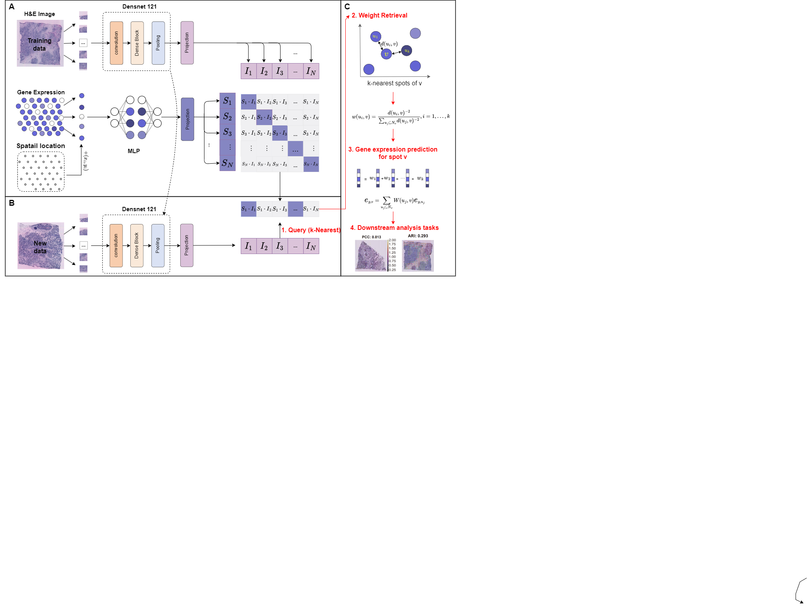

# STMCL: Leveraging AI to Infer Spatial Gene Expression from Histological Data

In this paper, we propose STMCL, an innovative multimodal deep learning approach that utilizes a contrastive learning framework to accurately predict spatial gene expression profiles. STMCL effectively integrates multimodal data, including histological images, gene expression profiles of individual spots, precise spatial coordinates, and gene expression data. We evaluated STMCL using four publicly available spatial transcriptomics datasets.
The experimental results indicate that our method surpasses existing methods in accurately predicting gene expression profiles from histological images. Additionally, it exhibits significant advantages in interpreting highly expressed genes specific to cancer and detecting particular spatial domains.

## System environment
Required package:
- PyTorch >= 2.1.0
- scanpy >= 1.8
- python >=3.9

## Datasets
Four publicly available ST datasets were used in this study. You can download them from https://zenodo.org/records/13117873 or find them on the following websites：
-  human HER2-positive breast tumor ST data from https://github.com/almaan/her2st/.
-  human cutaneous squamous cell carcinoma 10x Visium data from GSE144240.
-  dorsolateral prefrontal cortex (DLPFC) dataset from spatialLIBD package (http://spatial.libd.org/spatialLIBD).
-  Swarbrick’s Laboratory Visium data from https://doi.org/10.48610/4fb74a9.

## STmcl pipeline

- Run `hvg_visium.py` generation of highly variable genes.
- Run `train.py`
- Run `evel.py`

